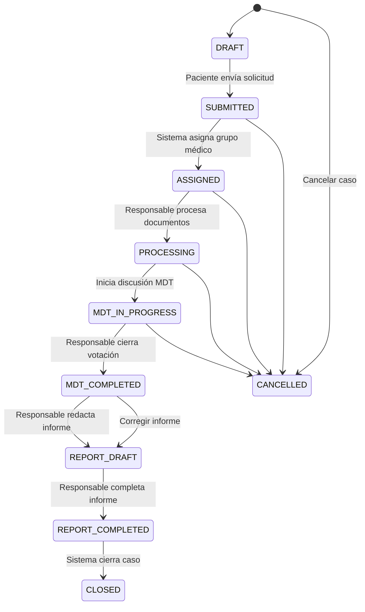

# Sistema de Segunda Opinión Oncológica - SecondOpinionMed

## Documentación Técnica Unificada

> **Versión del documento:** 1.0  
> **Última actualización:** Marzo 2025  
> **Proyecto:** SecondOpinionMed - Plataforma de Segunda Opinión Oncológica

---

## Tabla de Contenidos

1. [Visión General del Sistema](#1-visión-general-del-sistema)
2. [Arquitectura Técnica](#2-arquitectura-técnica)
3. [Modelo de Datos](#3-modelo-de-datos)
4. [Flujos de Trabajo](#4-flujos-de-trabajo)
5. [Sistema de Comités Multidisciplinarios (MDT)](#5-sistema-de-comités-multidisciplinarios-mdt)
6. [Algoritmo de Asignación](#6-algoritmo-de-asignación)
7. [Sistema de Notificaciones](#7-sistema-de-notificaciones)
8. [Seguridad y Cumplimiento](#8-seguridad-y-cumplimiento)
9. [Endpoints y URLs](#9-endpoints-y-urls)
10. [Stack Tecnológico](#10-stack-tecnológico)

---

## 1. Visión General del Sistema

### 1.1 Propósito

**SecondOpinionMed** es una plataforma web profesional desarrollada en Django que permite a los pacientes solicitar evaluaciones médicas de sus casos oncológicos. El sistema coordina comités multidisciplinarios (MDT - Multidisciplinary Team) donde múltiples especialistas evalúan colaborativamente cada caso.

### 1.2 Actores del Sistema

| Rol | Código | Descripción |
|-----|--------|-------------|
| **Paciente** | `patient` | Usuario que solicita segunda opinión médica |
| **Médico** | `doctor` | Especialista que evalúa casos y participa en comités |
| **Administrador** | `staff` | Administrador de la plataforma |

### 1.3 Características Principales

- ✅ Asignación automática de casos mediante algoritmo round-robin avanzado
- ✅ Comités multidisciplinarios especializados por tipo de cáncer
- ✅ Sistema de votación y consenso entre médicos
- ✅ Workflow de estados con transiciones controladas (FSM)
- ✅ Notificaciones en tiempo real (in-app + email)
- ✅ Auditoría completa de todas las acciones
- ✅ Cifrado de datos sensibles (PHI)
- ✅ API REST para integración

---

## 2. Arquitectura Técnica

### 2.1 Estructura del Proyecto

```
SecondOpinionMed/
├── apps/
│   ├── authentication/      # Gestión de usuarios y perfiles
│   ├── pacientes/          # Gestión de pacientes (legacy)
│   ├── medicos/            # Gestión de médicos y comités
│   ├── cases/              # Sistema principal de casos y MDT
│   ├── administracion/     # Panel de administración
│   ├── notifications/      # Sistema de notificaciones
│   ├── documents/          # Gestión de documentos
│   ├── core/               # Utilidades compartidas
│   └── public/             # Vistas públicas
├── templates/               # Plantillas HTML
├── static/                 # Archivos estáticos
├── media/                  # Archivos subidos
└── docs/                   # Documentación
```

### 2.2 Arquitectura de Alto Nivel

```
┌─────────────────────────────────────────────────────────────────┐
│                        CLIENTE (Navegador)                       │
│  ┌─────────────┐  ┌─────────────┐  ┌─────────────┐           │
│  │   Paciente  │  │   Médico    │  │    Admin    │           │
│  └──────┬──────┘  └──────┬──────┘  └──────┬──────┘           │
└─────────┼────────────────┼────────────────┼─────────────────────┘
          │                │                │
          ▼                ▼                ▼
┌─────────────────────────────────────────────────────────────────┐
│                     NGINX (Reverse Proxy)                        │
│                   Puerto 80/443 - SSL/TLS                        │
└──────────────────────────┬──────────────────────────────────────┘
                           │
┌──────────────────────────▼──────────────────────────────────────┐
│               DJANGO + GUNICORN (Servidor WSGI)                │
│  ┌──────────────────────────────────────────────────────────┐  │
│  │                    APLICACIONES Django                    │  │
│  │  authentication | medicos | cases | notifications       │  │
│  └──────────────────────────────────────────────────────────┘  │
└──────────────────────────┬──────────────────────────────────────┘
                           │
         ┌─────────────────┼─────────────────┐
         ▼                 ▼                  ▼
┌───────────────┐  ┌───────────────┐  ┌───────────────┐
│  PostgreSQL   │  │     Redis     │  │   Almacenamiento│
│   (Datos)     │  │ (Caché/Cola)  │  │    Local/S3   │
└───────────────┘  └───────────────┘  └───────────────┘
                           │
                           ▼
                   ┌───────────────┐
                   │    Celery     │
                   │   Workers     │
                   └───────────────┘
```

### 2.3 Stack Tecnológico

| Componente | Tecnología | Versión |
|------------|------------|---------|
| Backend | Django | 6.0 |
| Python | Python | 3.11+ |
| Base de Datos | PostgreSQL | 14+ |
| Cache/Cola | Redis | 7.0+ |
| Tareas Asíncronas | Celery | 5.3+ |
| Frontend | HTML5 + Tailwind CSS | 3.4+ |
| Servidor Web | Nginx + Gunicorn | - |

---

## 3. Modelo de Datos

### 3.1 Autenticación y Usuarios

#### CustomUser ([`apps/authentication/models.py:14`](apps/authentication/models.py:14))

Modelo de usuario extendido que reemplaza el modelo predeterminado de Django.

```python
class CustomUser(AbstractUser):
    ROLE_CHOICES = (
        ('patient', 'Paciente'),
        ('doctor', 'Médico'),
    )
    
    email = models.EmailField(unique=True)
    role = models.CharField(max_length=20, choices=ROLE_CHOICES, default='patient')
    is_active = models.BooleanField(default=False)  # Activo tras verificación de email
    email_verified = models.BooleanField(default=False)
    created_at = models.DateTimeField(auto_now_add=True)
    updated_at = models.DateTimeField(auto_now=True)
```

**Métodos:**
- `is_patient()`: Retorna True si el usuario es paciente
- `is_doctor()`: Retorna True si el usuario es médico

#### PatientProfile ([`apps/authentication/models.py:66`](apps/authentication/models.py:66))

Perfil del paciente con datos sensibles cifrados.

```python
class PatientProfile(models.Model):
    user = models.OneToOneField(CustomUser, related_name='patient_profile')
    full_name = EncryptedCharField(max_length=255)        # CIFRADO
    identity_document = EncryptedCharField(max_length=50) # CIFRADO
    phone_number = EncryptedCharField(max_length=20)     # CIFRADO
    date_of_birth = models.DateField(null=True, blank=True)
    genero = models.CharField(max_length=20, choices=GENERO_CHOICES)
    primary_diagnosis = EncryptedTextField(blank=True)    # CIFRADO
    medical_history = EncryptedTextField(blank=True)     # CIFRADO
    current_treatment = EncryptedTextField(blank=True)   # CIFRADO
```

#### EmailVerificationToken ([`apps/authentication/models.py:226`](apps/authentication/models.py:226))

Token para verificación de email del usuario.

```python
class EmailVerificationToken(models.Model):
    user = models.OneToOneField(CustomUser)
    token = models.CharField(max_length=64, unique=True)
    expires_at = models.DateTimeField()
    is_used = models.BooleanField(default=False)
    used_at = models.DateTimeField(null=True, blank=True)
    
    def is_valid(self):
        return not self.is_used and timezone.now() < self.expires_at
```

### 3.2 Médicos y Especialidades

#### Medico ([`apps/medicos/models.py:49`](apps/medicos/models.py:49))

Modelo del médico especialista.

```python
class Medico(TimeStampedModel):
    ESTADOS = (
        ('activo', 'Activo'),
        ('inactivo', 'Inactivo'),
        ('suspendido', 'Suspendido'),
    )
    
    # Información básica
    usuario = models.OneToOneField(settings.AUTH_USER_MODEL, related_name='medico')
    tipo_documento = models.CharField(max_length=20, choices=TIPOS_DOCUMENTO)
    numero_documento = models.CharField(max_length=20, unique=True)
    nombres = models.CharField(max_length=100)
    apellidos = models.CharField(max_length=100)
    fecha_nacimiento = models.DateField()
    genero = models.CharField(max_length=20, choices=GENEROS)
    
    # Información profesional
    registro_medico = models.CharField(max_length=20, unique=True)
    especialidades = models.ManyToManyField(Especialidad, related_name='medicos')
    experiencia_anios = models.PositiveIntegerField(default=0)
    institucion_actual = models.CharField(max_length=100)
    
    # Estado y disponibilidad
    estado = models.CharField(max_length=20, choices=ESTADOS, default='activo')
    disponible_segundas_opiniones = models.BooleanField(default=True)
    max_casos_mes = models.PositiveIntegerField(default=10)
    casos_actuales = models.PositiveIntegerField(default=0)
    
    # Estadísticas
    casos_revisados = models.PositiveIntegerField(default=0)
    casos_comite = models.PositiveIntegerField(default=0)
    calificacion_promedio = models.DecimalField(max_digits=3, decimal_places=2, default=0.00)
```

#### Especialidad ([`apps/medicos/models.py:9`](apps/medicos/models.py:9))

```python
class Especialidad(models.Model):
    nombre = models.CharField(max_length=100, unique=True)
    descripcion = models.TextField(blank=True)
    activa = models.BooleanField(default=True)
```

#### TipoCancer ([`apps/medicos/models.py:23`](apps/medicos/models.py:23))

Catálogo de tipos de cáncer para clasificar los casos.

```python
class TipoCancer(models.Model):
    nombre = models.CharField(max_length=100, unique=True)
    codigo = models.CharField(max_length=20, unique=True)  # Ej: PULMON, MAMA
    descripcion = models.TextField(blank=True)
    especialidad_principal = models.ForeignKey(Especialidad, null=True)
    activo = models.BooleanField(default=True)
```

#### Localidad ([`apps/medicos/models.py:141`](apps/medicos/models.py:141))

```python
class Localidad(TimeStampedModel):
    nombre = models.CharField(max_length=200, unique=True)
    medico = models.ForeignKey(Medico, null=True, blank=True, related_name='localidades')
    comite = models.ForeignKey('ComiteMultidisciplinario', null=True, blank=True)
```

### 3.3 Grupos Médicos y Comités

#### MedicalGroup ([`apps/medicos/models.py:206`](apps/medicos/models.py:206))

Grupo médico / Comité oncológico especializado (MDT).

```python
class MedicalGroup(TimeStampedModel):
    nombre = models.CharField(max_length=100, unique=True)
    tipos_cancer = models.ManyToManyField(TipoCancer, related_name='grupos_medicos')
    descripcion = models.TextField(blank=True)
    responsable_por_defecto = models.ForeignKey(Medico, null=True, blank=True)
    quorum_config = models.PositiveSmallIntegerField(default=3)
    activo = models.BooleanField(default=True)
    
    @property
    def miembros_activos(self):
        return self.miembros.filter(activo=True, disponible_asignacion_auto=True)
    
    @property
    def numero_miembros(self):
        return self.miembros_activos.count()
    
    def puede_asignar_caso(self):
        return self.activo and self.numero_miembros >= self.quorum_config
```

#### DoctorGroupMembership ([`apps/medicos/models.py:276`](apps/medicos/models.py:276))

Membresía de un médico en un grupo médico.

```python
class DoctorGroupMembership(TimeStampedModel):
    ROL_CHOICES = [
        ('coordinador', 'Coordinador'),
        ('miembro_senior', 'Miembro Senior'),
        ('miembro_regular', 'Miembro Regular'),
        ('residente', 'Residente (Observador)'),
        ('invitado', 'Especialista Invitado'),
    ]
    
    medico = models.ForeignKey(Medico, related_name='membresias_grupo')
    grupo = models.ForeignKey(MedicalGroup, related_name='miembros')
    rol = models.CharField(max_length=20, choices=ROL_CHOICES, default='miembro_regular')
    es_responsable = models.BooleanField(default=False)
    puede_votar = models.BooleanField(default=True)
    puede_declara_consenso = models.BooleanField(default=False)
    disponible_asignacion_auto = models.BooleanField(default=True)
    activo = models.BooleanField(default=True)
```

#### ComiteMultidisciplinario ([`apps/medicos/models.py:162`](apps/medicos/models.py:162))

Comité multidisciplinario tradicional.

```python
class ComiteMultidisciplinario(TimeStampedModel):
    nombre = models.CharField(max_length=100, unique=True)
    descripcion = models.TextField()
    especialidades_requeridas = models.ManyToManyField(Especialidad)
    medicos_miembros = models.ManyToManyField(Medico, blank=True)
    coordinador = models.ForeignKey(Medico, null=True, blank=True)
    min_medicos = models.PositiveIntegerField(default=3)
    max_casos_simultaneos = models.PositiveIntegerField(default=5)
    casos_actuales = models.PositiveIntegerField(default=0)
    activo = models.BooleanField(default=True)
```

### 3.4 Casos y Estados

#### Case ([`apps/cases/models.py:24`](apps/cases/models.py:24))

Modelo principal de caso de segunda opinión.

```python
class Case(models.Model):
    STATUS_CHOICES = (
        ('DRAFT', 'Borrador'),
        ('SUBMITTED', 'Enviado'),
        ('ASSIGNED', 'Asignado'),
        ('PROCESSING', 'Procesando'),
        ('MDT_IN_PROGRESS', 'En Análisis por MDT'),
        ('MDT_COMPLETED', 'Discusión MDT Cerrada'),
        ('REPORT_DRAFT', 'Informe en Redacción'),
        ('REPORT_COMPLETED', 'Informe Completado'),
        ('OPINION_COMPLETE', 'Opinión Completa'),
        ('CLOSED', 'Cerrado'),
        ('CANCELLED', 'Cancelado'),
    )
    
    # Relaciones
    patient = models.ForeignKey(CustomUser, related_name='patient_cases')
    doctor = models.ForeignKey(CustomUser, null=True, blank=True, related_name='doctor_cases')
    medical_group = models.ForeignKey(MedicalGroup, null=True, blank=True, related_name='cases')
    responsable = models.ForeignKey(Medico, null=True, blank=True, related_name='cases_responsable')
    
    # Datos del caso
    case_id = models.CharField(max_length=50, unique=True)  # "CASO-B28C7C3ABE7B"
    primary_diagnosis = EncryptedCharField(max_length=255)  # CIFRADO
    specialty_required = models.CharField(max_length=100)
    tipo_cancer = models.ForeignKey(TipoCancer, null=True, blank=True)
    estadio = models.CharField(max_length=10, choices=ESTADIO_CHOICES, blank=True)
    tratamiento_propuesto_original = models.TextField(blank=True)
    objetivo_consulta = models.TextField(blank=True)
    description = EncryptedTextField()  # CIFRADO
    diagnosis_date = models.DateField(null=True, blank=True)
    localidad = models.ForeignKey(Localidad, null=True, blank=True)
    referring_institution = models.CharField(max_length=255, blank=True)
    
    # Estado FSM
    status = FSMField(max_length=30, choices=STATUS_CHOICES, default='DRAFT')
    
    # Fechas
    created_at = models.DateTimeField(auto_now_add=True)
    assigned_at = models.DateTimeField(null=True, blank=True)
    fecha_limite = models.DateField(null=True, blank=True)
    completed_at = models.DateTimeField(null=True, blank=True)
```

**Transiciones FSM:**

| Transición | Source | Target | Descripción |
|------------|--------|--------|-------------|
| `submit_case` | DRAFT | SUBMITTED | El paciente envía la solicitud |
| `assign_to_group` | SUBMITTED | ASSIGNED | Sistema asigna a grupo médico |
| `process_documents` | ASSIGNED | PROCESSING | El responsable procesa documentos |
| `iniciar_discusion_mdt` | PROCESSING | MDT_IN_PROGRESS | Inicia discusión con comité |
| `cerrar_votacion` | MDT_IN_PROGRESS | MDT_COMPLETED | El responsable cierra votación |
| `iniciar_informe` | MDT_COMPLETED | REPORT_DRAFT | Responsable comienza informe |
| `completar_informe` | REPORT_DRAFT | REPORT_COMPLETED | Responsable completa informe |
| `cerrar_caso` | REPORT_COMPLETED | CLOSED | Caso cerrado, informe entregado |
| `cancelar_caso` | * | CANCELLED | Cancela el caso |

#### CaseDocument ([`apps/cases/models.py:286`](apps/cases/models.py:286))

Documentos médicos asociados a un caso.

```python
class CaseDocument(models.Model):
    DOCUMENT_TYPE_CHOICES = (
        ('resumen_historia_clinica', 'Resumen de Historia Clínica'),
        ('resultado_laboratorios', 'Resultado de Laboratorios'),
        ('resultado_imagenologia', 'Resultado de Imagenología'),
        ('imagenes', 'Imágenes'),
        ('resultado_biopsia', 'Resultado de Biopsia'),
        ('otros_documentos', 'Otros Documentos Relevantes'),
    )
    
    case = models.ForeignKey(Case, related_name='documents')
    document_type = models.CharField(max_length=50, choices=DOCUMENT_TYPE_CHOICES)
    file = models.FileField(upload_to=case_document_upload_path)
    description = models.CharField(max_length=255, blank=True)
    s3_file_path = models.CharField(max_length=1024, blank=True)
    is_anonymized = models.BooleanField(default=False)
    file_size = models.PositiveIntegerField(null=True, blank=True)
    mime_type = models.CharField(max_length=100, blank=True)
    file_name = models.CharField(max_length=255)
    uploaded_by = models.ForeignKey(CustomUser, null=True)
    uploaded_at = models.DateTimeField(auto_now_add=True)
```

**Ruta de upload:**
```
media/cases/{case_id}/documents/{carpeta}/{filename}
```

Carpetas映射:
- `resumen_historia_clinica` → Resumen de Historia Clínica
- `resultado_laboratorios` → Resultado de Laboratorios
- `resultado_imagenologia` → Resultado de Imagenología
- `imagenes` → Imágenes
- `resultado_biopsia` → Resultado de Biopsia
- `otros_documentos` → Otros Documentos

#### MedicalOpinion ([`apps/cases/models.py:462`](apps/cases/models.py:462))

Opinión/Voto individual de un médico miembro del comité.

```python
class MedicalOpinion(models.Model):
    VOTO_CHOICES = [
        ('acuerdo', 'De acuerdo con el tratamiento propuesto'),
        ('desacuerdo', 'En desacuerdo con el tratamiento propuesto'),
        ('abstencion', 'Se abstiene de emitir opinión'),
    ]
    
    case = models.ForeignKey(Case, related_name='opiniones')
    doctor = models.ForeignKey(Medico, related_name='opiniones_casos')
    voto = models.CharField(max_length=20, choices=VOTO_CHOICES)
    comentario_privado = models.TextField(blank=True)
    fecha_emision = models.DateTimeField(auto_now_add=True)
    actualizado_en = models.DateTimeField(auto_now=True)
```

#### SecondOpinion ([`apps/cases/models.py:369`](apps/cases/models.py:369))

Opinión final del médico asignado.

```python
class SecondOpinion(models.Model):
    case = models.OneToOneField(Case, related_name='second_opinion')
    doctor = models.ForeignKey(CustomUser, related_name='opinions')
    opinion_text = models.TextField()
    recommendations = models.TextField(blank=True)
    created_at = models.DateTimeField(auto_now_add=True)
    updated_at = models.DateTimeField(auto_now=True)
```

#### CaseAuditLog ([`apps/cases/models.py:406`](apps/cases/models.py:406))

Registro de auditoría del caso.

```python
class CaseAuditLog(models.Model):
    ACTION_CHOICES = (
        ('create', 'Creación'),
        ('read', 'Lectura'),
        ('update', 'Actualización'),
        ('delete', 'Eliminación'),
        ('document_upload', 'Carga de Documento'),
        ('opinion_added', 'Opinión Agregada'),
        ('clarification_requested', 'Aclaración Solicitada'),
    )
    
    case = models.ForeignKey(Case, related_name='audit_logs')
    user = models.ForeignKey(CustomUser, on_delete=models.CASCADE)
    action = models.CharField(max_length=50, choices=ACTION_CHOICES)
    description = models.TextField(blank=True)
    timestamp = models.DateTimeField(auto_now_add=True)
    ip_address = models.GenericIPAddressField(null=True, blank=True)
```

### 3.5 Modelos MDT

#### MDTMessage ([`apps/cases/mdt_models.py:17`](apps/cases/mdt_models.py:17))

Mensaje en el chat del comité MDT.

```python
class MDTMessage(TimeStampedModel):
    TIPO_CHOICES = [
        ('mensaje', 'Mensaje'),
        ('sistema', 'Mensaje del Sistema'),
        ('adjunto', 'Adjunto'),
    ]
    
    caso = models.ForeignKey(Case, null=True, blank=True, related_name='mdt_messages')
    grupo = models.ForeignKey(MedicalGroup, related_name='messages')
    autor = models.ForeignKey(Medico, related_name='mdt_messages')
    tipo = models.CharField(max_length=20, choices=TIPO_CHOICES, default='mensaje')
    contenido = models.TextField()
    mensaje_padre = models.ForeignKey('self', null=True, blank=True, related_name='respuestas')
    es_privado = models.BooleanField(default=False)
    esta_editado = models.BooleanField(default=False)
    leido_por = models.ManyToManyField(Medico, blank=True)
```

#### UserPresence ([`apps/cases/mdt_models.py:114`](apps/cases/mdt_models.py:114))

Control de presencia de usuarios en tiempo real.

```python
class UserPresence(TimeStampedModel):
    ESTADO_CHOICES = [
        ('online', 'Conectado'),
        ('away', 'Ausente'),
        ('busy', 'En Llamada/Videollamada'),
        ('offline', 'Desconectado'),
    ]
    
    usuario = models.ForeignKey(Medico, related_name='presencias')
    caso = models.ForeignKey(Case, null=True, blank=True, related_name='participantes_conectados')
    estado = models.CharField(max_length=20, choices=ESTADO_CHOICES, default='offline')
    ultimo_heartbeat = models.DateTimeField(auto_now=True)
    ip_address = models.GenericIPAddressField(null=True, blank=True)
    
    @property
    def esta_activo(self):
        diff = timezone.now() - self.ultimo_heartbeat
        return diff.seconds < 300  # 5 minutos
```

#### AlgoritmoConfig ([`apps/cases/mdt_models.py:168`](apps/cases/mdt_models.py:168))

Configuración global del algoritmo de asignación.

```python
class AlgoritmoConfig(TimeStampedModel):
    nombre = models.CharField(max_length=100, unique=True, default='configuracion_default')
    ponderacion_carga = models.PositiveIntegerField(default=50)
    modo_estricto = models.BooleanField(default=False)
    limite_mensual_por_medico = models.PositiveIntegerField(default=15)
    permitir_overrides = models.BooleanField(default=True)
    activo = models.BooleanField(default=True)
```

### 3.6 Notificaciones

#### Notification ([`apps/notifications/models.py:101`](apps/notifications/models.py:101))

Notificaciones in-app.

```python
class Notification(models.Model):
    TIPO_CHOICES = [
        ('asignacion_caso', 'Nuevo caso asignado'),
        ('nueva_opinion', 'Nueva opinión en caso'),
        ('recordatorio_voto', 'Recordatorio de votación'),
        ('votacion_cerrada', 'Votación cerrada'),
        ('informe_disponible', 'Informe final disponible'),
        ('caso_actualizado', 'Caso actualizado'),
        ('documento_subido', 'Nuevo documento subido'),
    ]
    
    receptor = models.ForeignKey(CustomUser, related_name='notificaciones')
    tipo = models.CharField(max_length=30, choices=TIPO_CHOICES)
    titulo = models.CharField(max_length=200)
    mensaje = models.TextField()
    enlace = models.CharField(max_length=500, blank=True)
    leido = models.BooleanField(default=False)
    caso_id = models.CharField(max_length=50, null=True, blank=True)
    fecha_creacion = models.DateTimeField(auto_now_add=True)
    fecha_lectura = models.DateTimeField(null=True, blank=True)
```

#### EmailLog ([`apps/notifications/models.py:7`](apps/notifications/models.py:7))

Log de emails enviados.

```python
class EmailLog(models.Model):
    STATUS_CHOICES = [
        ('PENDING', 'Pending'),
        ('SUCCESS', 'Success'),
        ('FAILED', 'Failed'),
        ('RETRYING', 'Retrying'),
    ]
    
    recipient = models.EmailField()
    subject = models.CharField(max_length=255)
    template_name = models.CharField(max_length=255, blank=True)
    status = models.CharField(max_length=20, choices=STATUS_CHOICES, default='PENDING')
    context_json = models.JSONField(default=dict, blank=True)
    sent_at = models.DateTimeField(null=True, blank=True)
    retries_attempted = models.PositiveIntegerField(default=0)
    error_message = models.TextField(null=True, blank=True)
    created_at = models.DateTimeField(auto_now_add=True)
```

#### DoctorInvitation ([`apps/notifications/models.py:64`](apps/notifications/models.py:64))

Invitación para registrar médicos.

```python
class DoctorInvitation(models.Model):
    invited_email = models.EmailField()
    token = models.UUIDField(default=uuid.uuid4, editable=False, unique=True)
    invited_by = models.ForeignKey(settings.AUTH_USER_MODEL, null=True, blank=True)
    expires_at = models.DateTimeField()
    is_used = models.BooleanField(default=False)
    created_at = models.DateTimeField(auto_now_add=True)
```

---

## 4. Flujos de Trabajo

### 4.1 Flujo: Registro y Verificación de Paciente

```
1. USUARIO VISITA PÁGINA
   └─> GET /accounts/register/

2. USUARIO COMPLETA FORMULARIO
    ├── Email (único)
    ├── Contraseña
    ├── Nombre completo
    └── Consentimiento T&C

3. DJANGO PROCESA REGISTRO
    ├── CustomUser.objects.create(
    │       email="paciente@email.com",
    │       role="patient",
    │       is_active=False,
    │       email_verified=False
    │   )
    ├── PatientProfile.objects.create(user=user, ...)
    └── EmailVerificationToken.objects.create(user=user, token=..., expires_at=24h)

4. SE ENVÍA EMAIL DE VERIFICACIÓN
    └── Celery Task: send_email_task

5. USUARIO VERIFICA EMAIL
    └── GET /accounts/verify/{token}/
            ├── Verifica token
            ├── user.is_active = True
            ├── user.email_verified = True
            └── Redirecciona a: /patients/dashboard/
```

### 4.2 Flujo: Creación de Solicitud de Segunda Opinión

```
1. PACIENTE ACCEDE A CREAR SOLICITUD
   └─> GET /solicitud/nueva/

2. FORMULARIO MULTI-PASO

   PASÓ 1: Datos del Paciente
   • Nombre completo (cifrado)
   • Documento de identidad (cifrado)
   • Fecha de nacimiento
   • Teléfono de contacto (cifrado)
   • Consentimiento informado
   
   PASÓ 2: Información Clínica
   • Diagnóstico primario (cifrado)
   • Tipo de cáncer (selección)
   • Estadio (I, II, III, IV, N/A)
   • Fecha del diagnóstico
   • Tratamiento propuesto original
   • Objetivo de la consulta
   
   PASÓ 3: Documentos Médicos
   • Upload de archivos (múltiples)
   • Tipos: Resumen historia clínica, Laboratorios, Imagenología, Biopsia
   • Validación: PDF, JPG, PNG (máx 50MB por archivo)
   
   PASÓ 4: Revisión y Confirmación
   • Resumen de todos los datos
   • Checkbox: Consentimiento explícito (OBLIGATORIO)
   • Botón: "Enviar Solicitud"

3. PROCESAMIENTO (CaseService.finalize_submission)
   ├── case_id = f"CASO-{uuid.uuid4().hex[:12].upper()}"
   ├── Case.objects.create(...)
   ├── case.submit_case()  # FSM: DRAFT → SUBMITTED
   ├── CaseAuditLog.objects.create(...)
   └── Asignar permisos guardian

4. SE DISPARA SEÑAL post_save
   └── signals.py: caso_asignado_signal
           └── AssignmentService.asignar_caso(caso)

5. ASIGNACIÓN AUTOMÁTICA
   ├── Obtiene medical_group según tipo_cancer
   ├── AssignmentService.get_candidatos(grupo)
   ├── Calcula scores (carga + antigüedad)
   ├── Selecciona mejor candidato
   ├── Asigna: caso.responsable = medico
   ├── Transición: SUBMITTED → ASSIGNED
   └── Notifica al médico asignado
```

### 4.3 Flujo: Revisión por Comité MDT

```
1. RESPONSABLE RECIBE NOTIFICACIÓN
   └── "Nuevo caso asignado: {case_id}"

2. RESPONSABLE REVISA DOCUMENTOS
   └── GET /doctors/case/{case_id}/

3. RESPONSABLE PROCESA CASO
   └── Transición: ASSIGNED → PROCESSING

4. RESPONSABLE INICIA DISCUSIÓN MDT
   └── Transición: PROCESSING → MDT_IN_PROGRESS

5. MIEMBROS DEL GRUPO EMITEN OPINIONES
   └── POST /doctors/case/{case_id}/opinion/
           └── MedicalOpinion.objects.create(
               case=case, doctor=medico, voto=..., comentario_privado=...
           )

6. RESPONSABLE CIERRA VOTACIÓN
   └── GET /doctors/case/{case_id}/cerrar-votacion/
           └── Transición: MDT_IN_PROGRESS → MDT_COMPLETED
           └── Notifica: "Votación cerrada"

7. RESPONSABLE REDACTA INFORME FINAL
   └── POST /doctors/case/{case_id}/report/
           └── Transición: MDT_COMPLETED → REPORT_DRAFT

8. RESPONSABLE COMPLETA INFORME
   └── Transición: REPORT_DRAFT → REPORT_COMPLETED

9. SISTEMA CIERRA CASO
   └── Transición: REPORT_COMPLETED → CLOSED

10. PACIENTE RECIBE NOTIFICACIÓN
    └── "Informe final disponible para caso {case_id}"
```

---

## 5. Sistema de Comités Multidisciplinarios (MDT)

### 5.1 Concepto

El sistema MDT permite que múltiples especialistas evalúen colaborativamente un caso oncológico. Cada **MedicalGroup** representa un comité especializado en uno o varios tipos de cáncer.

### 5.2 Estructura de un Grupo Médico

```
MedicalGroup: "Comité de Tumores Torácicos"
├── Tipos de cáncer: Pulmón, Esófago, Mediastino
├── Responsable por defecto: Dr. Juan Pérez
├── Quorum: 3 médicos mínimo
└── Miembros:
    ├── Dr. Juan Pérez (Coordinador)
    ├── Dra. María García (Miembro Senior)
    └── Dr. Carlos López (Miembro Regular)
```

### 5.3 Sistema de Votación

Cada médico del grupo puede emitir una opinión:

```python
class MedicalOpinion:
    VOTO_CHOICES = [
        ('acuerdo', 'De acuerdo con el tratamiento propuesto'),
        ('desacuerdo', 'En desacuerdo con el tratamiento propuesto'),
        ('abstencion', 'Se abstiene de emitir opinión'),
    ]
```

- **Acuerdo**: El médico respalda el tratamiento propuesto
- **Desacuerdo**: El médico no está de acuerdo y puede incluir opinión disidente
- **Abstención**: El médico no desea participar en la decisión

### 5.4 Chat MDT

Sistema de mensajería integrado para discusión entre miembros del comité.

```python
class MDTMessage:
    # Chat general del grupo (caso = null)
    # Chat de caso específico (caso = Case)
```

### 5.5 Presencia en Tiempo Real

Sistema de presencia que indica si un médico está:
- **online**: Conectado
- **away**: Ausente
- **busy**: En llamada/videollamada
- **offline**: Desconectado

---

## 6. Algoritmo de Asignación

### 6.1 Algoritmo Round-Robin Avanzado

El sistema usa un algoritmo de asignación avanzado que considera:

1. **Carga de trabajo**: Casos activos del médico
2. **Antigüedad**: Tiempo en el sistema
3. **Disponibilidad**: Estado del médico
4. **Límites mensuales**: Casos máximos por mes

### 6.2 Fórmula de Puntuación

```
Score_final = (ponderación × score_carga) - ((1 - ponderación) × score_antigüedad)

Donde:
- score_carga = min(1.0, casos_actuales / capacidad_máxima)
- score_antigüedad = min(1.0, días_activo / 1825)
- ponderación = configurable (0-100)
```

### 6.3 Configuración

```python
class AlgoritmoConfig:
    ponderacion_carga = 50        # 0-100, default 50
    modo_estricto = False         # Si True, usa round-robin puro
    limite_mensual_por_medico = 15
    permitir_overrides = True     # Permitir asignación manual
```

### 6.4 Flujo de Asignación

```
1. Caso se crea en estado SUBMITTED
2. Signal post_save detecta el cambio
3. Se obtiene el medical_group según tipo_cancer
4. Se filtran candidatos:
   - activo = True
   - disponible_segundas_opiniones = True
   - casos_actuales < limite_mensual
5. Se calculan scores para cada candidato
6. Se selecciona el de menor score
7. Se asigna al caso
8. Se notifica al médico
9. Se registra en auditoría
```

---

## 7. Sistema de Notificaciones

### 7.1 Tipos de Notificaciones

| Tipo | Descripción |
|------|-------------|
| `asignacion_caso` | Nuevo caso asignado a un médico |
| `nueva_opinion` | Nueva opinión en un caso |
| `recordatorio_voto` | Recordatorio de votación |
| `votacion_cerrada` | Votación cerrada |
| `informe_disponible` | Informe final disponible |
| `caso_actualizado` | Caso actualizado |
| `documento_subido` | Nuevo documento subido |

### 7.2 Canales de Notificación

1. **In-app**: Notificaciones en el panel del usuario
2. **Email**: Envío asíncrono via Celery

### 7.3 Log de Emails

```python
class EmailLog:
    # Estados: PENDING, SUCCESS, FAILED, RETRYING
    # Retry automático en caso de fallo
```

---

## 8. Seguridad y Cumplimiento

### 8.1 Medidas de Seguridad

| Aspecto | Implementación |
|---------|---------------|
| **Cifrado datos sensibles** | `django-fernet-fields` en campos clínicos |
| **Permisos a nivel objeto** | `django-guardian` |
| **Auditoría completa** | `CaseAuditLog` en todos los modelos críticos |
| **Autenticación** | Django auth con verificación de email |
| **Protección CSRF/XSS** | Middleware nativo de Django |
| **Roles** | CustomUser con roles patient/doctor |

### 8.2 Campos Cifrados

Los siguientes campos usan cifrado Fernet:

- `PatientProfile.full_name`
- `PatientProfile.identity_document`
- `PatientProfile.phone_number`
- `PatientProfile.primary_diagnosis`
- `PatientProfile.medical_history`
- `PatientProfile.current_treatment`
- `Case.primary_diagnosis`
- `Case.description`

### 8.3 Auditoría

Todas las acciones críticas se registran en `CaseAuditLog`:

```python
class CaseAuditLog:
    ACTION_CHOICES = [
        ('create', 'Creación'),
        ('read', 'Lectura'),
        ('update', 'Actualización'),
        ('delete', 'Eliminación'),
        ('document_upload', 'Carga de Documento'),
        ('opinion_added', 'Opinión Agregada'),
        ('clarification_requested', 'Aclaración Solicitada'),
    ]
```

---

## 9. Endpoints y URLs

### 9.1 URLs Principales

| Rol | Endpoint | Descripción |
|-----|----------|-------------|
| **Paciente** | `/patients/dashboard/` | Dashboard del paciente |
| **Paciente** | `/patients/case/<case_id>/` | Detalle de caso |
| **Médico** | `/doctors/dashboard/` | Dashboard del médico |
| **Médico** | `/doctors/case/<case_id>/` | Detalle de caso |
| **Médico** | `/doctors/casos-pendientes/` | Casos pendientes |
| **Médico** | `/doctors/mis-casos/` | Mis casos asignados |
| **Médico** | `/doctors/chat/` | Chat MDT |
| **Médico** | `/doctors/case/<case_id>/opinion/` | Emitir opinión |
| **Médico** | `/doctors/case/<case_id>/cerrar-votacion/` | Cerrar votación |
| **Médico** | `/doctors/case/<case_id>/report/` | Crear informe final |
| **Público** | `/consentimiento/` | Consentimiento informado |
| **Auth** | `/accounts/login/` | Inicio de sesión |
| **Auth** | `/accounts/register/` | Registro |

### 9.2 URLs de la API REST

| Método | Endpoint | Descripción |
|--------|----------|-------------|
| POST | `/api/auth/register/` | Registrar usuario |
| POST | `/api/auth/login/` | Iniciar sesión |
| GET | `/api/cases/` | Listar casos |
| POST | `/api/cases/` | Crear caso |
| GET | `/api/cases/<case_id>/` | Ver caso |
| PUT | `/api/cases/<case_id>/` | Actualizar caso |

---

## 10. Stack Tecnológico

### 10.1 Dependencias Principales

```
# Core
django>=6.0
python>=3.11
djangorestframework

# Estado y Permisos
django-fsm
django-guardian

# Cifrado
django-fernet-fields

# Tareas Asíncronas
celery
redis

# Base de datos
psycopg2-binary

# Frontend
django-crispy-forms
crispy-bootstrap5
tailwindcss

# Procesamiento PDF
reportlab

# Utilidades
python-dotenv
django-extensions
```

### 10.2 Estructura de Aplicaciones

```
apps/
├── authentication/       # CustomUser, PatientProfile, DoctorProfile
├── medicos/              # Medico, Especialidad, MedicalGroup
├── cases/                # Case, CaseDocument, MedicalOpinion
│   ├── models.py        # Modelos principales
│   ├── mdt_models.py    # Modelos MDT
│   ├── services.py      # CaseService
│   ├── mdt_services.py  # AssignmentService, ConsensusService
│   ├── views.py         # Vistas principales
│   └── signals.py       # Señales Django
├── notifications/        # Notification, EmailLog
├── administracion/       # Panel admin
├── documents/           # Gestión de documentos
└── core/                # Utilidades compartidas
```

---

## Anexo: Reglas de Negocio

### 1. Rol del Responsable del Caso

- **Función Primaria:** Redactor final oficial de la institución.
- **Responsabilidad:** Sintetizar el consenso del MDT en un informe formal dirigido al paciente, emitido "En nombre de la Institución".

### 2. Algoritmo de Asignación Automática y Equitativa (Rotativa)

- **Regla Base:** Basada en la especialidad oncológica requerida.
- **Mecanismo de Rotación (Round Robin):**
  - Lista ordenada de responsables por especialidad.
  - Asignación secuencial, reinicio al completar la lista.
  - Objetivo: Distribución equitativa de carga.

### 3. Protocolo de Comunicación con el Paciente

- **Contacto Telefónico:** Número de teléfono prominente como "Dato Crítico".
- **Iniciativa:** Solo por miembros del MDT analizando el caso.
- **Registro:** Toda llamada debe registrarse con fecha, hora, médico y resumen.

---

## Diagrama de Estados del Caso



---

*Documento generado automáticamente. Última actualización: Marzo 2025*
